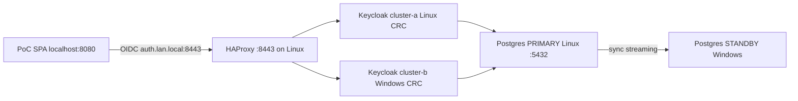

# RHBK / Keycloak multi-cluster v2 PoC

Dual Keycloak **26.7** clusters (`stateless` preview), Podman PostgreSQL **synchronous** replication across two LAN hosts, LAN HAProxy on `auth.lan.local:8443`, and a Red Hat–branded SPA for failover drills.

Official guides used (see `docs/`):

- Multi-cluster deployments (v2)
- Concepts for multi-cluster deployments (v2)
- Deploying Keycloak for HA with the Operator (v2)

---

## Current status (2026-07-27)

| Check | Result |
|--------|--------|
| Shared auth URL | **https://auth.lan.local:8443** → `192.168.0.114` (see [`docs/HOSTS.md`](docs/HOSTS.md)) |
| OIDC issuer | `https://auth.lan.local:8443/realms/poc-realm` |
| HAProxy `/lb-check` | **UP** — backends use SNI `auth.lan.local` to both CRCs |
| Site A / Site B | Both deployed with shared hostname; HAProxy marks a site **DOWN** when its Keycloak is stopped |
| **Failover drill** | **Proven:** Site A Keycloak stopped on Linux; SPA / login / token refresh kept working via **Site B (Windows)** |
| Postgres sync | **`site_b_standby`** @ `192.168.0.102` — `streaming` / `sync` |
| PoC SPA | [`apps/poc-spa`](apps/poc-spa) — users `alice`/`alice`, `bob`/`bob` |
| GitHub | https://github.com/Jerczey/rhbk-multi-cluster-v2 (private) |

**Hosts**

| Role | Host | IP |
|------|------|-----|
| Site A (primary) | Linux laptop + CRC | `192.168.0.114` |
| Site B (secondary) | Windows 11 + CRC | `192.168.0.102` |

**Namespace / images (both CRCs):** `rhbk-mc`, community Keycloak Operator **26.7.0**, image `quay.io/keycloak/keycloak:26.7.0`  
(RHBK Operator catalog tops out at 26.6.x; `stateless` / multi-cluster v2 needs 26.7+.)



---

## PoC SPA (multi-site recovery)

Enriched app based on the RHBK `js/spa` quickstart. Full steps: [`apps/poc-spa/README.md`](apps/poc-spa/README.md).

```bash
# /etc/hosts: 192.168.0.114 auth.lan.local
cd apps/poc-spa && npm install && npm run setup-realm && npm start
# http://localhost:8080 — alice/alice or bob/bob
```

Accept the self-signed cert once at https://auth.lan.local:8443/lb-check before logging in.  
**Check auth health** in the UI uses same-origin `/api/lb-check` (avoids browser TLS/CORS issues).

### Proven drill — Site A down

1. Log in to the SPA through `auth.lan.local:8443`.
2. Stop Site A Keycloak on Linux (scale/delete pod or stop the deployment).
3. HAProxy takes `site_a` out of rotation; `site_b` (Windows) keeps serving.
4. SPA **Refresh token** / continued use works; issuer stays `https://auth.lan.local:8443/realms/poc-realm`.

Bring Site A back when ready; it rejoins the LB when `/lb-check` is healthy again.

---

## What was done — Site A (Linux)

1. **Network / firewall** — LAN to `192.168.0.102`; Postgres `5432`, HAProxy `8443`, optional HTTP share `8765`.
2. **Podman Postgres primary** (`pg-primary-site-a`) — sync slot `site_b_standby`; `scripts/enable-sync-replication.sh` (no live `chown` of data dir).
3. **CRC + Keycloak Site A** — ns `rhbk-mc`, Operator 26.7, `stateless`, `cluster-a`, JDBC → `192.168.0.114:5432`.
4. **Shared hostname** — both CRs use `hostname: https://auth.lan.local:8443`; OpenShift route host `auth.lan.local`.
5. **HAProxy** (`kc-haproxy-lb`) — `:8443`, health `GET /lb-check`, SNI `auth.lan.local` to Linux + Windows CRC routers.
6. **SPA** — [`apps/poc-spa`](apps/poc-spa) with Red Hat branding and recovery panel.
7. Temporary Linux-only `keycloak-b` / local standby were removed once Windows owned Site B.

---

## What was done — Site B (Windows)

1. Podman + CRC; repo from GitHub.
2. Postgres sync standby via `postgres/standby/start-standby.ps1` (named volume).
3. Keycloak `cluster-b`, same DB primary, shared `auth.lan.local` hostname (see [`scripts/WINDOWS-SITE-B.md`](scripts/WINDOWS-SITE-B.md)).
4. Serves traffic when Site A is down (verified in failover drill).

---

## Quick verify

```bash
./scripts/verify-poc.sh

curl -sk https://auth.lan.local:8443/lb-check
curl -sk https://auth.lan.local:8443/realms/poc-realm/.well-known/openid-configuration | jq .issuer

podman exec pg-primary-site-a psql -U keycloak -d keycloak \
  -c "SELECT application_name, client_addr, state, sync_state FROM pg_stat_replication;"
# expect: site_b_standby | 192.168.0.102 | streaming | sync

# SPA health proxy (while npm start is running)
curl -s http://127.0.0.1:8080/api/lb-check
```

Keycloak admin (Linux CRC bootstrap secret):

```bash
oc get secret keycloak-initial-admin -n rhbk-mc -o jsonpath='{.data.password}' | base64 -d; echo
# user: temp-admin
```

---

## Scripts reference

| Script | Side | Purpose |
|--------|------|---------|
| `postgres/primary/start-primary.sh` | Linux | Start primary Postgres |
| `postgres/standby/start-standby.ps1` | Windows | Standby via named volume |
| `postgres/standby/configure-standby.sh` | Windows | Standby helpers |
| `scripts/enable-sync-replication.sh` | Linux | Enable sync wait for `site_b_standby` |
| `scripts/deploy-site-a.sh` / `deploy-site-b.sh` | Each CRC | Operator + Keycloak |
| `scripts/apply-haproxy-site-b.sh` | Linux | HAProxy Site B backend |
| `lb/start-haproxy.sh` | Linux | Start / recreate HAProxy |
| `scripts/promote-standby.sh` | Either | DB failover notes |
| `scripts/verify-poc.sh` | Linux | Smoke checks |
| `apps/poc-spa` (`npm start` / `setup-realm`) | Linux | Recovery SPA |

Credentials (gitignored): `secrets/*.env.example` → `secrets/*.env`. TLS: `scripts/gen-tls-secret.sh`.

---

## Operational notes

- Site-to-site traffic and Postgres sync stay on the **LAN**.
- Enable sync **only after** the Windows standby is streaming.
- Keycloak site failover is automatic via HAProxy `/lb-check`. **Database** failover still needs manual standby promote (see `scripts/promote-standby.sh`).
- Older RHBK demo in namespace `rhbk` on Linux was left alone; this PoC uses `rhbk-mc`.
