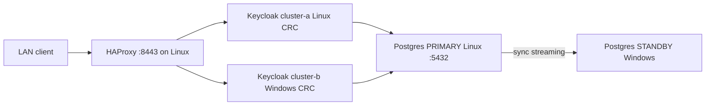

# RHBK / Keycloak multi-cluster v2 PoC

Dual Keycloak **26.7** clusters (`stateless` preview), Podman PostgreSQL **synchronous** replication across two LAN hosts, and a LAN HAProxy probing `/lb-check`.

Official guides used (see `docs/`):

- Multi-cluster deployments (v2)
- Concepts for multi-cluster deployments (v2)
- Deploying Keycloak for HA with the Operator (v2)

---

## Current status (2026-07-27)

| Check | Result |
|--------|--------|
| Site A `/lb-check` | **UP** — https://keycloak-a.apps-crc.testing |
| Site B `/lb-check` | **UP** — https://keycloak-b.apps-crc.testing (Windows `192.168.0.102`) |
| HAProxy LB | **UP** — https://192.168.0.114:8443 (round-robin Site A + Site B) |
| Postgres sync replication | **`site_b_standby` streaming / `sync`** from `192.168.0.102` |
| Keycloak JDBC to primary | Linux CRC + Windows CRC both connected |
| GitHub | https://github.com/Jerczey/rhbk-multi-cluster-v2 (private) |

**Hosts**

| Role | Host | IP |
|------|------|-----|
| Site A (primary) | Linux laptop + CRC | `192.168.0.114` |
| Site B (secondary) | Windows 11 + CRC | `192.168.0.102` |

**Namespace / images (both CRCs):** `rhbk-mc`, community Keycloak Operator **26.7.0**, image `quay.io/keycloak/keycloak:26.7.0`  
(RHBK Operator catalog tops out at 26.6.x; `stateless` / multi-cluster v2 needs 26.7+.)



---

## What was done — Site A (Linux)

1. **Network / firewall**
   - Confirmed LAN reachability to Windows (`192.168.0.102`).
   - Opened host firewall for Postgres `5432/tcp` from LAN / CRC networks (and later `8443` for HAProxy, `8765` for optional HTTP share).

2. **Podman Postgres primary** (`pg-primary-site-a`)
   - Image `postgres:17-alpine`, DB/user `keycloak`, replication user `replicator`, slot `site_b_standby`.
   - Config: `wal_level=replica`, later `synchronous_standby_names = 'FIRST 1 (site_b_standby)'` once Windows standby streamed.
   - Scripts: `postgres/primary/start-primary.sh`, `scripts/enable-sync-replication.sh`.

3. **CRC + Keycloak Site A**
   - Namespace `rhbk-mc`, community Operator subscription (`manifests/operator/subscription.yaml`).
   - Deployed Keycloak CR `keycloak` with `features: [stateless]`, cluster name `cluster-a`, JDBC to `192.168.0.114:5432`, route `keycloak-a.apps-crc.testing`.
   - Script: `scripts/deploy-site-a.sh` / `manifests/site-a/keycloak.yaml`.
   - Proved CRC pods can reach host Postgres (source often appears as `169.254.1.2` via pasta).

4. **Temporary dual cluster on Linux (later removed)**
   - Briefly ran `keycloak-b` / `cluster-b` on the **same** Linux CRC to validate multi-cluster v2 before Windows was ready.
   - Deleted Linux `keycloak-b` when Windows Site B came up.
   - Local `pg-standby-site-b` on Linux was stopped so Windows could own the standby slot.

5. **HAProxy**
   - Container `kc-haproxy-lb` on Linux `:8443`, health check `GET /lb-check`.
   - Site A via `host.containers.internal:443`; Site B via `192.168.0.102:443` + SNI `keycloak-b.apps-crc.testing`.
   - Scripts: `lb/start-haproxy.sh`, `scripts/apply-haproxy-site-b.sh`.

6. **Repo / helpers**
   - Published to GitHub; optional LAN file share `http://192.168.0.114:8765/`.
   - Fixed `enable-sync-replication.sh` to use `ALTER SYSTEM` (no live `chown` of data dir — that caused `pg_filenode.map` permission errors).

---

## What was done — Site B (Windows)

1. **Prerequisites**
   - Installed Podman and CRC on Windows 11; Cursor used for the cutover.
   - Cloned / synced https://github.com/Jerczey/rhbk-multi-cluster-v2.

2. **Postgres sync standby** (`pg-standby-site-b`)
   - Basebackup from Linux primary `192.168.0.114` with slot `site_b_standby`, `application_name=site_b_standby`.
   - Used Podman **named volume** (bind mounts on Windows broke postgres UID ownership) — see `postgres/standby/start-standby.ps1` + `configure-standby.sh`.
   - Linux then ran `./scripts/enable-sync-replication.sh` → `sync_state=sync`.

3. **CRC → Linux primary DB**
   - Verified from a Windows CRC pod: `psql` / JDBC to `192.168.0.114:5432`.

4. **Keycloak Site B**
   - Same Operator channel / image as Site A in ns `rhbk-mc`.
   - Keycloak CR with `stateless`, cluster name **`cluster-b`**, JDBC to **primary** `192.168.0.114:5432` (not the local standby).
   - Route `keycloak-b.apps-crc.testing` on Windows CRC.
   - Script: `scripts/deploy-site-b.sh` / `manifests/site-b/keycloak.yaml`.

5. **Client DNS / hosts**
   - On each machine / client: `keycloak-a.apps-crc.testing` → Linux CRC path; `keycloak-b.apps-crc.testing` → `192.168.0.102` for LAN clients.
   - Detailed checklist: [scripts/WINDOWS-SITE-B.md](scripts/WINDOWS-SITE-B.md).

---

## Quick verify

**Linux**

```bash
./scripts/verify-poc.sh
# or manually:
curl -sk https://keycloak-a.apps-crc.testing/lb-check
curl -sk --resolve keycloak-b.apps-crc.testing:443:192.168.0.102 \
  https://keycloak-b.apps-crc.testing/lb-check
curl -sk https://192.168.0.114:8443/lb-check

podman exec pg-primary-site-a psql -U keycloak -d keycloak \
  -c "SELECT application_name, client_addr, state, sync_state FROM pg_stat_replication;"
# expect: site_b_standby | 192.168.0.102 | streaming | sync
```

**Cross-site realm (shared DB)**

```bash
# Create/list via Site A admin; OIDC discovery works on both hosts:
curl -sk https://keycloak-a.apps-crc.testing/realms/poc-realm/.well-known/openid-configuration
curl -sk --resolve keycloak-b.apps-crc.testing:443:192.168.0.102 \
  https://keycloak-b.apps-crc.testing/realms/poc-realm/.well-known/openid-configuration
```

Admin (bootstrap secret on Linux CRC Site A):

```bash
oc get secret keycloak-initial-admin -n rhbk-mc -o jsonpath='{.data.password}' | base64 -d; echo
# user: temp-admin
```

---

## Scripts reference

| Script | Side | Purpose |
|--------|------|---------|
| `postgres/primary/start-primary.sh` | Linux | Start primary Postgres |
| `postgres/standby/start-standby.ps1` | Windows | Standby via named volume |
| `postgres/standby/configure-standby.sh` | Windows | Standby ownership / conninfo helpers |
| `scripts/enable-sync-replication.sh` | Linux | Enable sync wait for `site_b_standby` |
| `scripts/deploy-site-a.sh` | Linux | Operator + Keycloak `cluster-a` |
| `scripts/deploy-site-b.sh` | Windows | Operator + Keycloak `cluster-b` |
| `scripts/apply-haproxy-site-b.sh` | Linux | Point HAProxy `site_b` at Windows CRC |
| `lb/start-haproxy.sh` | Linux | Start / recreate HAProxy |
| `scripts/promote-standby.sh` | Either | DB failover dry-run / promote notes |
| `scripts/verify-poc.sh` | Linux | Smoke checks |

Credentials (gitignored): copy from `secrets/*.env.example` → `secrets/*.env`. TLS: `scripts/gen-tls-secret.sh`.

---

## Operational notes

- **Do not** put ngrok (or any tunnel) in the Postgres sync path; LAN only for site-to-site. Ngrok remains optional later in front of the LAN HAProxy for external demos.
- Enable sync **only after** Windows standby is streaming; otherwise primary commits can block.
- Failover still needs **manual** promote of the Windows standby and re-pointing Keycloak JDBC (see `scripts/promote-standby.sh`).
- Existing older RHBK demo in namespace `rhbk` on Linux CRC was left alone; this PoC uses `rhbk-mc`.
