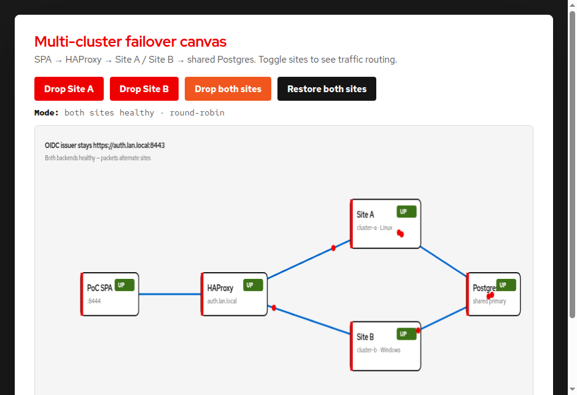

# RHBK / Keycloak multi-cluster v2 PoC

Dual Keycloak **26.7** clusters (`stateless` preview), Podman PostgreSQL **synchronous** replication across two LAN hosts, LAN HAProxy on `auth.lan.local:8443`, and a Red Hat–branded SPA for failover drills.

Official guides used (see `docs/`):

- Multi-cluster deployments (v2)
- Concepts for multi-cluster deployments (v2)
- Deploying Keycloak for HA with the Operator (v2)

---

## Last verified (2026-07-29)

| Check | Result |
|--------|--------|
| Shared auth URL | **https://auth.lan.local:8443** → `192.168.0.114` (see [`docs/HOSTS.md`](docs/HOSTS.md)) |
| OIDC issuer | `https://auth.lan.local:8443/realms/poc-realm` |
| HAProxy `/lb-check` | **UP** — backends use SNI `auth.lan.local` to both CRCs |
| Site A / Site B | Both deployed with shared hostname; HAProxy marks a site **DOWN** when its Keycloak is stopped |
| **Failover drill** | **Proven:** Site A Keycloak / CRC stopped on Linux; SPA / login / token refresh kept working via **Site B (Windows)** |
| Postgres sync | **`site_b_standby`** @ `192.168.0.102` — `streaming` / `sync` |
| PoC SPA | [`apps/poc-spa`](apps/poc-spa) — Node on **Linux** (`https://auth.lan.local:8444`); users `alice`/`alice`, `bob`/`bob` |
| GitHub | https://github.com/Jerczey/rhbk-multi-cluster-v2 (**public**) |

**Hosts**

| Role | Host | IP |
|------|------|-----|
| Site A (primary) | Linux laptop + CRC | `192.168.0.114` |
| Site B (secondary) | Windows 11 + CRC | `192.168.0.102` |

**Namespace / images (both CRCs):** `rhbk-mc`, community Keycloak Operator **26.7.0**, image `quay.io/keycloak/keycloak:26.7.0`  
(RHBK Operator catalog tops out at 26.6.x; `stateless` / multi-cluster v2 needs 26.7+.)

### Architecture

[](https://htmlpreview.github.io/?https://raw.githubusercontent.com/Jerczey/rhbk-multi-cluster-v2/main/docs/presentations/failover-canvas-demo.html)

**Interactive failover canvas** — drop Site A, Site B, or both; animated packets show how HAProxy routes OIDC traffic.  
- **In browser (GitHub):** [open interactive demo](https://htmlpreview.github.io/?https://raw.githubusercontent.com/Jerczey/rhbk-multi-cluster-v2/main/docs/presentations/failover-canvas-demo.html)  
- **From a clone:** open `docs/presentations/failover-canvas-demo.html` in a browser (or `xdg-open docs/presentations/failover-canvas-demo.html`)

PoC SPA (Linux HTTPS `:8444`) → HAProxy (`auth.lan.local:8443`) → Keycloak `cluster-a` (Linux CRC) / `cluster-b` (Windows CRC) → Postgres primary (Linux `:5432`) with sync standby (Windows).

---

## Why `stateless` / multi-cluster v2

### Main attribute

With `features.enabled: [stateless]` (Keycloak **26.7** in this PoC), each site can answer any request **without sticky sessions** and **without sharing an Infinispan cluster across sites**.

- Local embedded caches stay **per site** (`spi-cache-embedded--default--cluster-name`: `cluster-a` / `cluster-b` in the CRs).
- State that must survive site failover is **externalized** (mainly to the shared database).
- Clients keep one public issuer: `https://auth.lan.local:8443`.

So “stateless” here does **not** mean “no data.” It means the Keycloak process is not the cross-site source of truth: **no reliance on in-memory cluster state across the WAN**.

### Why this was hard before

Older multi-node / multi-DC Keycloak assumed:

- Sessions, authentication sessions, and related runtime state lived primarily in **embedded Infinispan**.
- Nodes needed **sticky load balancing** and/or **cache replication**.
- Multi-datacenter usually meant **Infinispan cross-site (XSite)** — WAN latency, split-brain risk, and heavy operations.

A **shared Postgres alone did not fix multi-cluster** in that model: the hot path still depended on memory the other site did not have. Mid-login or token refresh after failing over to another site would break without stickiness or XSite.

### What made the current design possible

Roughly three shifts (Keycloak multi-cluster deployments **v2** / community **~26.x**; this lab needs **26.7+** — RHBK Operator catalogs that top out at 26.6.x do not expose this path yet):

1. **Persist cross-site-critical session-related state** so another site can read it from storage.
2. **Keep embedded cache per site only** (local performance), not as the multi-site source of truth.
3. **One public hostname / issuer** plus an LB health check (`/lb-check`) so clients do not care which CRC answers.

### Is the database the main solver?

**For multi-cluster Keycloak: the shared DB is the main shared brain** — realms, users, keys, and the persisted session-related state both sites need.

It is necessary but not sufficient by itself:

| Piece | Role |
|--------|------|
| **Shared DB** (both sites JDBC → Postgres primary on Linux in this lab) | Same users, realm, keys, and persisted session state |
| **`stateless` feature** | Stops depending on cross-site Infinispan / sticky affinity |
| **Same hostname / issuer** | Tokens and redirects stay valid after failover |
| **HAProxy `/lb-check`** | Removes a dead Keycloak site from rotation |
| **Postgres sync standby** (Windows) | **Database DR**, not Keycloak session affinity — promote remains a separate, manual path |

**Takeaway:** **shared DB + `stateless` together** enable “either site can serve the IdP.” The DB without `stateless` was never enough for multi-site failover; `stateless` without a shared (or consistently replicated) DB would not work either. The Site A–down drill in this PoC is that combination working.

---

## PoC SPA (multi-site recovery)

Enriched app based on the RHBK `js/spa` quickstart. Runs as **Node on the Linux host** (HTTP `:8080` for local use, HTTPS `:8444` for LAN / Windows browsers). Full steps: [`apps/poc-spa/README.md`](apps/poc-spa/README.md).

```bash
# /etc/hosts on Linux and Windows: 192.168.0.114 auth.lan.local
cd apps/poc-spa && npm install && npm run setup-realm && npm start
# Local:  http://localhost:8080
# From Windows / LAN: https://auth.lan.local:8444  (alice/alice or bob/bob)
```

Accept the self-signed cert once at https://auth.lan.local:8443/lb-check (and again for `:8444` if prompted).  
**Check auth health** in the UI uses same-origin `/api/lb-check` (avoids browser TLS/CORS issues).

Do **not** use plain `http://192.168.0.114:8080` from another host — browsers block Web Crypto / PKCE outside a secure context.

### Proven drill — Site A down

1. Log in to the SPA (OIDC via `auth.lan.local:8443`).
2. Stop Site A Keycloak on Linux (scale/delete pod) **or** `crc stop` on Linux (platform failure; leave Podman Postgres + HAProxy up).
3. HAProxy takes `site_a` out of rotation; `site_b` (Windows) keeps serving.
4. SPA **Refresh token** / continued use works; issuer stays `https://auth.lan.local:8443/realms/poc-realm`.

Bring Site A back when ready; it rejoins the LB when `/lb-check` is healthy again.

---

## What was done — Site A (Linux)

1. **Network / firewall** — LAN to `192.168.0.102`; Postgres `5432`, HAProxy `8443`, SPA HTTPS `8444`, optional HTTP share `8765`.
2. **Podman Postgres primary** (`pg-primary-site-a`) — sync slot `site_b_standby`; `scripts/enable-sync-replication.sh` (no live `chown` of data dir).
3. **CRC + Keycloak Site A** — ns `rhbk-mc`, Operator 26.7, `stateless`, `cluster-a`, JDBC → `192.168.0.114:5432`.
4. **Shared hostname** — both CRs use `hostname: https://auth.lan.local:8443`; OpenShift route host `auth.lan.local`.
5. **HAProxy** (`kc-haproxy-lb`) — `:8443`, health `GET /lb-check`, SNI `auth.lan.local` to Linux + Windows CRC routers.
6. **SPA** — [`apps/poc-spa`](apps/poc-spa) with Red Hat branding, recovery panel, HTTPS on `:8444` for LAN clients.
7. Temporary Linux-only `keycloak-b` / local standby were removed once Windows owned Site B.

---

## What was done — Site B (Windows)

1. Podman + CRC; repo from GitHub.
2. Postgres sync standby via `postgres/standby/start-standby.ps1` (named volume).
3. Keycloak `cluster-b`, same DB primary, shared `auth.lan.local` hostname (see [`scripts/WINDOWS-SITE-B.md`](scripts/WINDOWS-SITE-B.md)).
4. Serves traffic when Site A is down (verified in failover drill).
5. SPA is **not** deployed on Windows CRC — use the Linux SPA at **https://auth.lan.local:8444** from a Windows browser.

---

## Quick verify

```bash
./scripts/verify-poc.sh

curl -sk https://auth.lan.local:8443/lb-check
curl -sk https://auth.lan.local:8443/realms/poc-realm/.well-known/openid-configuration | jq .issuer

podman exec pg-primary-site-a psql -U keycloak -d keycloak \
  -c "SELECT application_name, client_addr, state, sync_state FROM pg_stat_replication;"
# expect: site_b_standby | 192.168.0.102 | streaming | sync

# SPA health proxy (while npm start is running)
curl -sk https://auth.lan.local:8444/api/lb-check
# or: curl -s http://127.0.0.1:8080/api/lb-check
```

Keycloak admin (Linux CRC bootstrap secret):

```bash
oc get secret keycloak-initial-admin -n rhbk-mc -o jsonpath='{.data.password}' | base64 -d; echo
# user: temp-admin
```

---

## Scripts reference

| Script | Side | Purpose |
|--------|------|---------|
| `postgres/primary/start-primary.sh` | Linux | Start primary Postgres |
| `postgres/standby/start-standby.ps1` | Windows | Standby via named volume |
| `postgres/standby/configure-standby.sh` | Windows | Standby helpers |
| `scripts/enable-sync-replication.sh` | Linux | Enable sync wait for `site_b_standby` |
| `scripts/deploy-site-a.sh` | Linux | Operator + Keycloak `cluster-a` |
| `scripts/deploy-site-b.sh` | Windows | Operator + Keycloak `cluster-b` |
| `scripts/apply-haproxy-site-b.sh` | Linux | Point HAProxy `site_b` at Windows CRC |
| `lb/start-haproxy.sh` | Linux | Start / recreate HAProxy |
| `scripts/promote-standby.sh` | Either | DB failover notes |
| `scripts/verify-poc.sh` | Linux | Smoke checks |
| `apps/poc-spa` (`npm start` / `setup-realm`) | Linux | Recovery SPA (HTTP + HTTPS) |

Credentials (gitignored): `secrets/*.env.example` → `secrets/*.env`. TLS: `scripts/gen-tls-secret.sh`.

---

## Operational notes

- Site-to-site traffic and Postgres sync stay on the **LAN**.
- Enable sync **only after** the Windows standby is streaming.
- Keycloak site failover is automatic via HAProxy `/lb-check`. **Database** failover still needs manual standby promote (see `scripts/promote-standby.sh`).
- Older RHBK demo in namespace `rhbk` on Linux was left alone; this PoC uses `rhbk-mc`.
